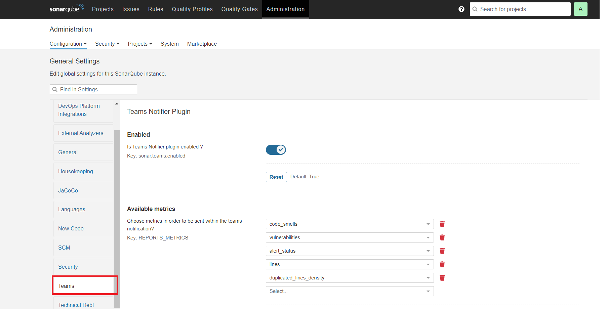
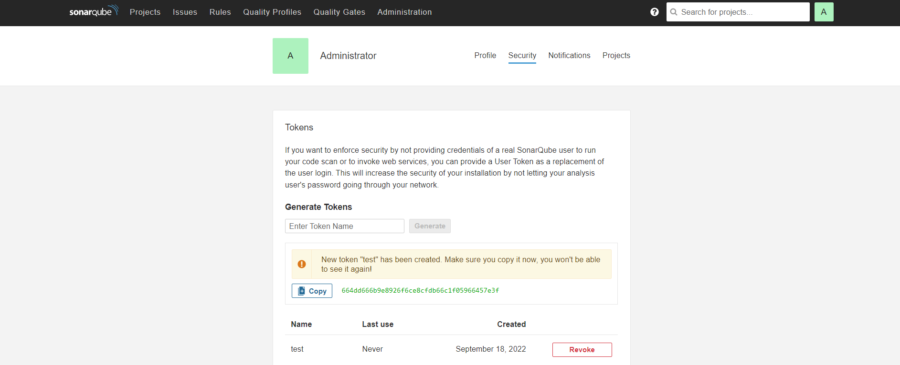

# Sonar Teams Notifier

Teams notifier is a plugin for sonarqube in order to send teams notification regarding Project metrics such as quality gate

# Usage

---

### Administration

There is a few settings required inorder to start the plugin properly 



Settings :

- Enabled : Plugin works only if enabled is marked as true ( Default value = true )
- Available metrics : Multiple select list to define metrics to be posted within the teams message
- Quality Gate Status : Single select list to specify post conditions

 

# Scanner side

---

```bash
mvn  \
-Dsonar.host.url="yourSonarServerIp" \
-Dsonar.login="sonarTokenValue" \
-Dsonar.projectKey="projectKey" \
-Dsonar.projectName="projectName" \
-Dsonar.analysis.projectId="projectName" \
-Dsonar.sources="sonarSource" \
-Dsonar.teams.hook="channelWebHook"\
 sonar:sonar

```

### Required Parameters :

|                Property name |          Required |                          Description |
| --- | --- | --- |
|                   sonar.host.url |             TRUE | hoted sonarqube url  |
|                      sonar.login |             TRUE | token provided by sonar web application /account/security/ |
|                 sonar.projectKey |             TRUE |  projectKey value to retrieve metrics |
|                sonar.projectName |             TRUE |  projectName value |
|             sonar.analysis.projectId |             TRUE | projectId value |
|                 sonar.sources |             TRUE |  provide sources to scan (Java project EXP : "pom.xml,src/main”) |
|               sonar.teams.hook |             TRUE | Microsoft teams incoming webhook |

